# 基于 Compose For Web Kotlin/Wasm 的天气预报应用网页端

#### [开发语言：Kotlin](https://kotlinlang.org/)

#### [界面框架：Compose Multiplatform](https://www.jetbrains.com.cn/compose-multiplatform/)

#### [网络请求：Ktor](https://ktor.io/)

#### [构建工具：Gradle](https://plugins.gradle.org/)

## 本项目采用了 MVVM 模式进行设计

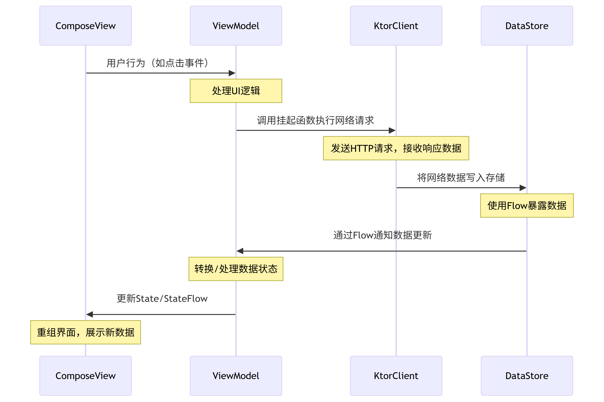
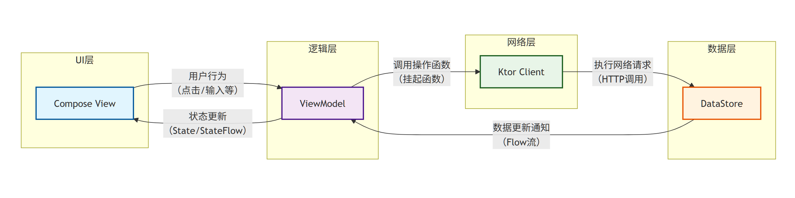

## [访问 Kotlin / Js 版本](https://tojs.nmstarry.qzz.io/)

## [访问 Kotlin / Wasm 版本](https://qytq.nmstarry.qzz.io/)

## Android 端演示视频

https://github.com/user-attachments/assets/359c6542-825b-4f74-a8d8-2e0acbc89bf7

##  Web 端演示视频 

https://github.com/user-attachments/assets/43838340-7835-40b1-9db5-1b1b07ff6789

## 如果浏览器不支持 WASM 则会出现以下情况：

1.显示以下图片内容，例如一加手机和魅族手机系统浏览器

####

2.无法显示任何内容，网页名称和图标正常加载，控制台显示有关于 WASM 的异常（也可能不显示）

####

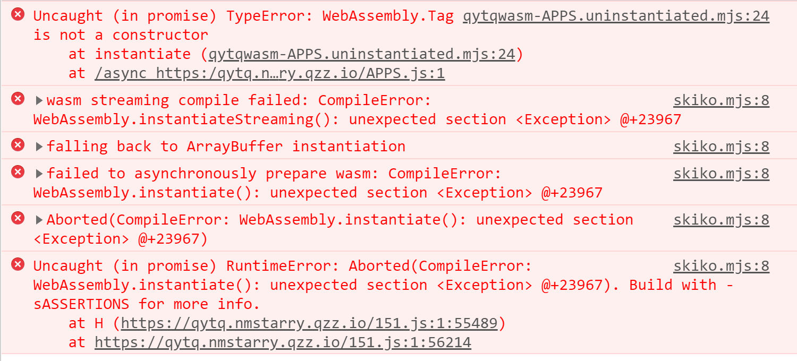
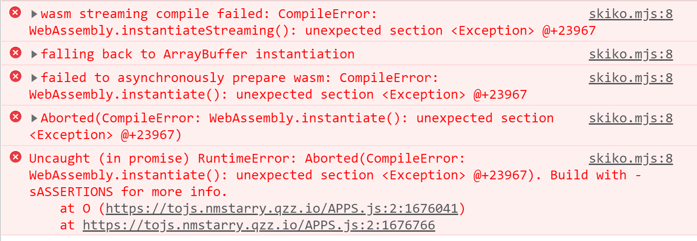

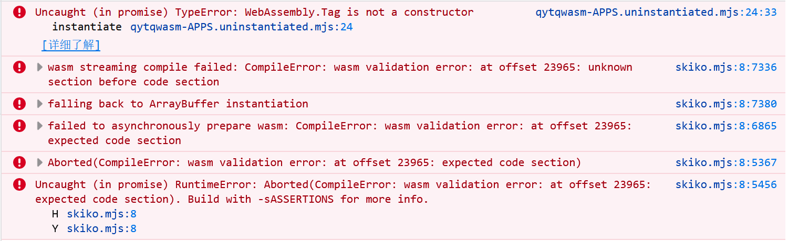
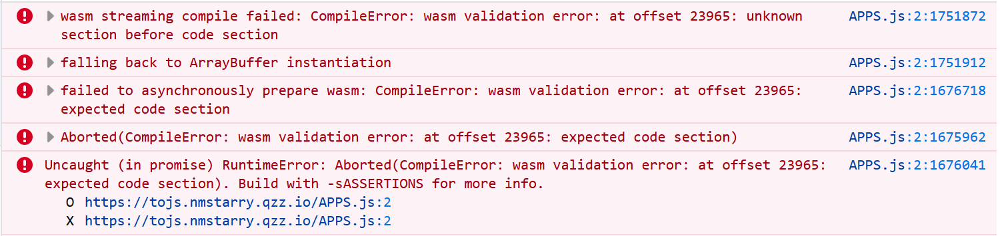

## 来自官网的性能对比图

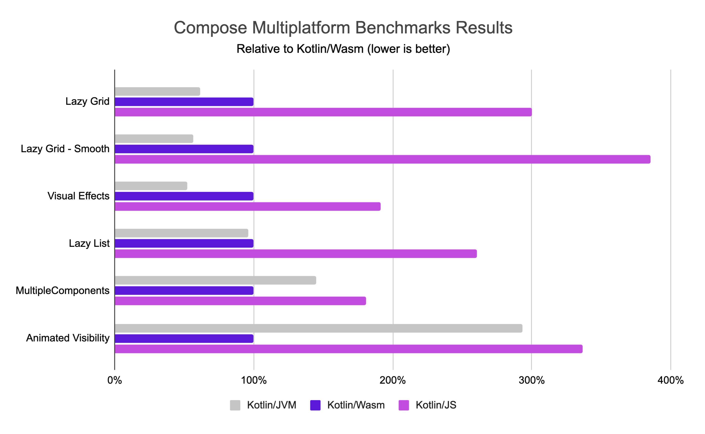

## 移动端（Web）Kotlin/Js 和 Kotlin/Wasm

核心都是 WebAssembly ,区别就是 Kotlin/Wasm 比 Kotlin/Js 兼容性更差

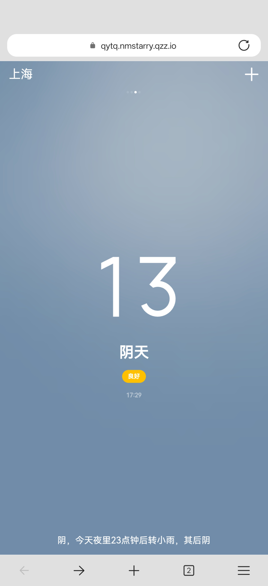
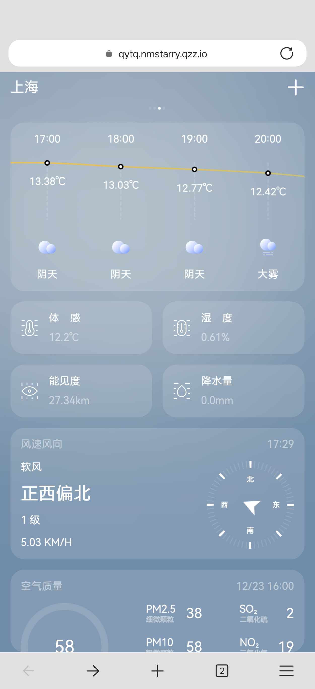
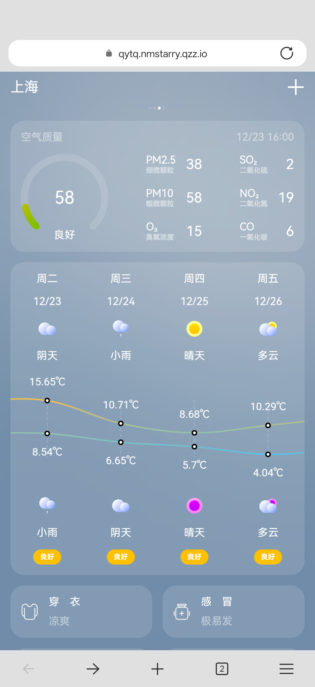
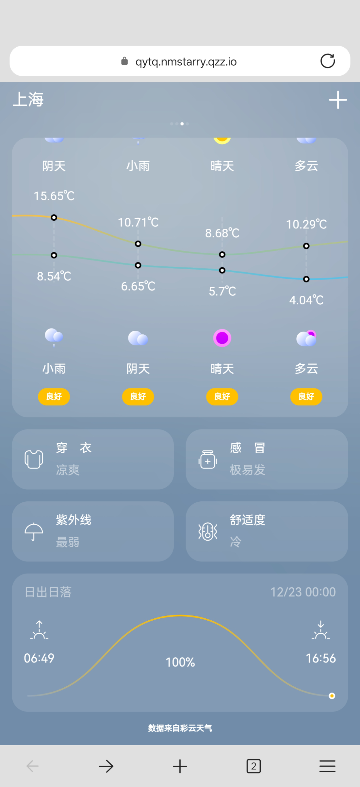
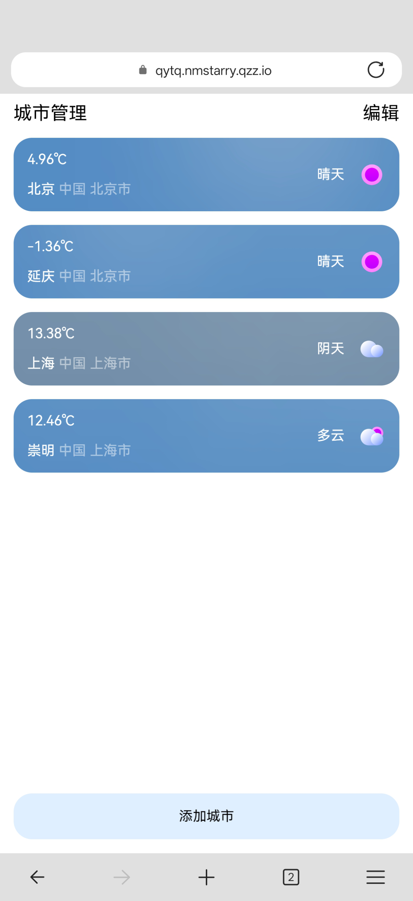

## 移动端（Android）

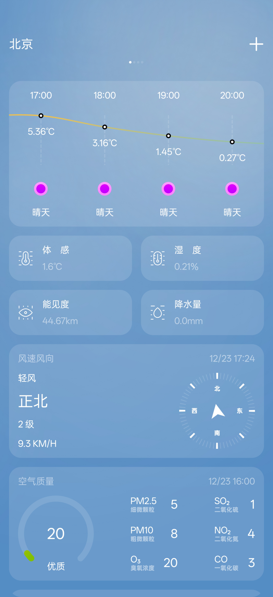
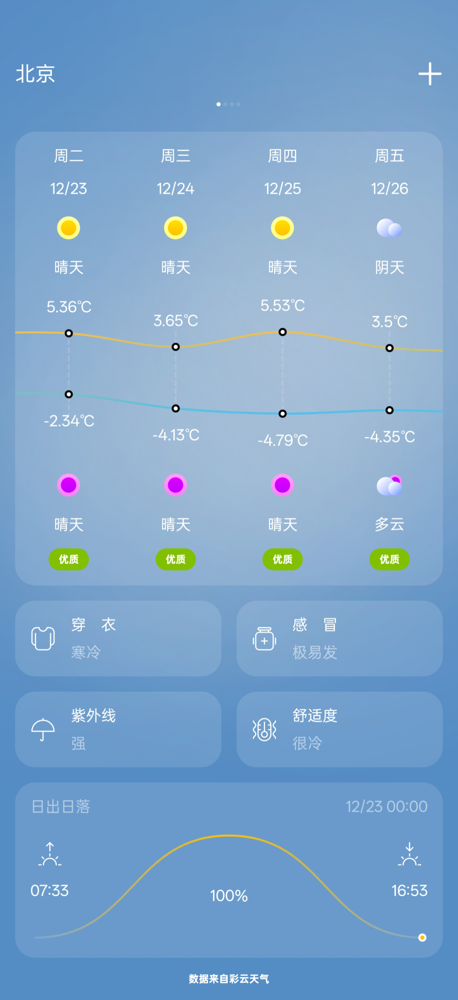
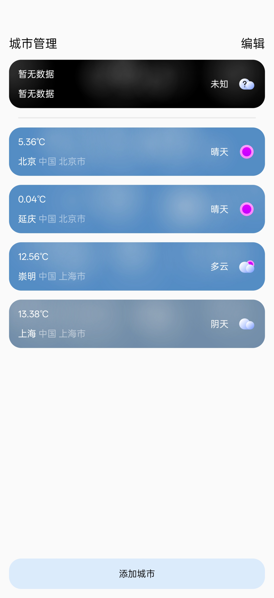

## 已知问题

1.嵌套滚动问题

2.中文乱码，Kotlin/Wasm 本身支持中文、日文、韩文等非ASCII字符的，根源在于 WebAssembly (Wasm) 底层没有原生的字符串类型，只能通过引入字体文件显示

## 项目源码将在 2026 年 4 月 1 日之前上传
