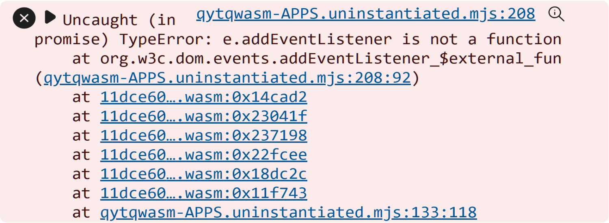

# 基于 Compose For Web Kotlin / Wasm 的天气预报应用网页端

#### [开发语言：Kotlin](https://kotlinlang.org/)

#### [界面框架：Compose Multiplatform](https://www.jetbrains.com.cn/compose-multiplatform/)

#### [网络请求：Ktor](https://ktor.io/)

## [访问 Kotlin / Js 版本](https://tojs.nmstarry.qzz.io/)

## [访问 Kotlin / Wasm 版本](https://qytq.nmstarry.qzz.io/)

##  Android 端演示视频 

https://github.com/user-attachments/assets/c668adda-f4a3-46d7-8135-6a53df5abd81

##  Web 端演示视频 

https://github.com/user-attachments/assets/b06fe734-b71f-4bbf-bfb5-a0f5f7e37784

##  如果浏览器不支持 WASM 则会出现以下情况： 

1.无法显示任何内容，网页名称和图标正常加载，控制台显示有关于 WASM 的异常

####

2.显示以下图片内容，例如一加手机和魅族手机系统浏览器

####

## 移动端（Web）Kotlin / Js 和 Kotlin / Wasm

核心都是 WebAssembly ,区别就是 Kotlin / Wasm 比 Kotlin / Js 兼容性更差

  
  
  
  
  

## 移动端（Android）

  
  
  
  

## 核心架构

##  项目源码将在 2026 年 4 月 1 日之前上传 
